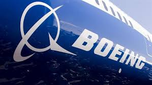
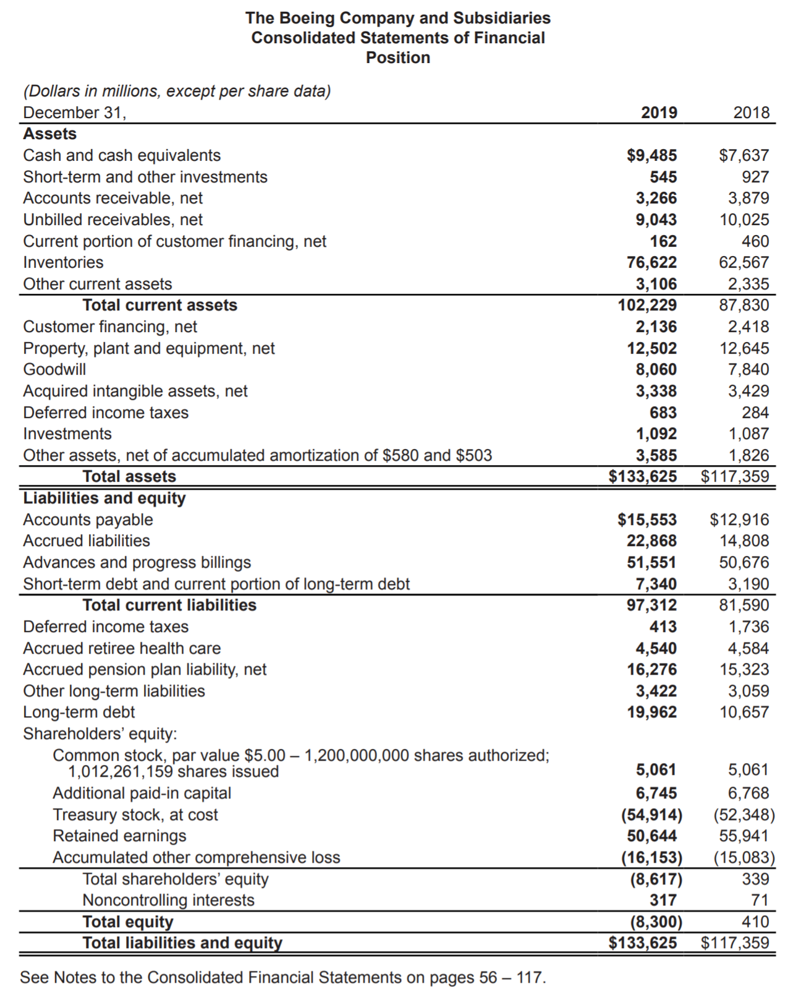

# BOEING FINANCIAL ANALYSIS REPORT
**Lam Nguyen**
---

# COMPANY PROFILE

Boeing is a long-established company focusing on the mission to “connect, protect, explore and inspire the world through aerospace innovation”. It was founded in 1916 and incorporated on July 19, 1934, had elected Dennis A. Muilenburg as its official CEO.

With a 103-year history of innovation and development, the pioneer in aerospace discovery has achieved amazing milestones in the success of commercial air transportation, naming Boeing 737 MAX 9, 787-10, and TX. But not just there, Boeing has also been enthusiastically expanding its market by investing in satellite intelligence to serve defense mission, cultivating the power of solar cells in exploring space, and raising the concern for eco-friendly products by testing data in the use of energy and time-saving. Our pioneer has been leading the run for more than a century and it is still.

However, 2018-2019 has been quite a tough time for Boeing. On October 29, 2018, and March 20, 2019, two Boeing 737 MAX 8 flights crashed with no survivors. Two continuous affairs in less than 6 months have raised tremendous rage among victims’ families, confronted Boeing with dozens of lawsuits, questionable model’s safety, and internal operation revisions. On the financial market, Boeing stock falls sharply after each deadly crash, specifically 7% after the first and 9% after the second one. Wall Street financial analysts predict a succeeding decline in the stock price to as low as $300 this autumn. But is this really the case? The market actually knows what to do: look forward. With the long history of development and current continuous innovation, the long-run vision of Boeing is still really promising and profitable. Investors perceive that such risks can be overcome and Boeing is still holding certainty that its model of MAX will be coming back this year or in early 2020. BA, Boeing’s ticker symbol, reached 349.93$ on 29 October and will, for sure, experience fluctuations.

Boeing is not alone in the race of large jet airliner production. With Airbus, a European entrenched company, the duo is considered as if creating a duopoly. Although with differences in regions, currency, technology, etc, since the 2010s, the two competitors are mostly always close to each other, even in a hard time of Boeing. While Boeing takes more advantage edge of the U.S. market, Airbus takes that of Asia. All to be said, despite a problematic year and a formidable competitor, Boeing is still a giant holding the worth to invest in, or to buy a stock of.

# FINANCIAL STATEMENTS
---

All data below is sourced from Boeing 2018 Annual report, specifically:
Income Statement_Consolidated Statements of Operations
Balance Sheet_Consolidated Statements of Financial Position

Change between data of 2017 and 2018, in:
Sales: 7.58%
Cash: -13.34%
Cost of sales (COGS): 6.37%
Inventory: 1.92%
Total current assets: 3.09%
Total assets: 4.45%
Total liabilities: 5.69%
Total current liabilities: 9.30%
Net income (loss): 23.67%
Total equity: -76.07%

Excel Sheet: https://bit.ly/34ghE87

All data below is calculated from data provided in Boeing 2018 Annual report, specifically:
Income Statement_Consolidated Statements of Operations
Balance Sheet_Consolidated Statements of Financial Position

**2018**
* Current Ratio/Liquidity = Current AssetsCurrent Liability = 87,83081,590 = 1.08
*  Return on Equity = Net IncomeShareholders' Equity = 10,460339 = 30.86 (3085.55%)
* Debt to Equity Ratio = Total Liabilities (Debt)Total Equity = (3,190 + 10,657)410 = 33.77
* Return on Assets = Net IncomeAverage Total Assets = 10,460(117,359 + 112,362) / 2 = 0.09$ (9.11%)
* Profit Margin = Net IncomeNet Sales = 10,460101,127 = 0.10$ (10.34%)
2017
* Current Ratio/Liquidity = Current AssetsCurrent Liability = 85,19474,648 = 1.14
* Return on Equity = Net IncomeShareholders' Equity = 8,4581,656 =5.11$  (510.75%)
* Debt to Equity Ratio = Total Liabilities (Debt)Total Equity = (1,335 + 9,782)1,713 = 6.49
* Return on Assets = Net IncomeAverage Total Assets = 8,458(117,359 + 112,362) / 2 = 0.07$ (7.36%)
* Profit Margin = Net IncomeNet Sales = 8,45894,005 = 0.09$ (9.00%)

# INTERPRETIVE ANALYSIS
---

### LiIQUIDITY

Liquidity is the ability to turn the available assets of the company into cash, which is also its ability to pay the debt/liabilities regardless of it being long-term or short-term. And Boeing was experiencing a decrease in liquidity over the two-year period.

From the data, we can say that the company is considerably not flush with cash and in a need of raising more money, but that’s not necessarily a bad news. Although Boeing experienced a decrease in liquidity, the liquidity is still above ‘safe’ rate of 1.0, which assures the ability to pay short-term debt. Such reduction can be put down to its effort in boosting investment in continuous technology innovation, including but not limited to AnalytX on data, HorizonX on startup investment, etc. To be said, Boeing is considerably using its assets and money on more areas. With the current strategy and liquidity rate, the company will be able to do much more and develop even more in the future.

### PROFIT MARGIN

Profit margin measures the profitability, or how much profit, in percentage, a dollar of sales can generate by dividing the net income by the net sales. Boeing's profit margin in both 2018 and 2019 were on a positive increasing index.

3% increase in the profit margin is a really nice effort of Boeing. Comparing to others in the same industry at around 10-12%, Boeing is at the average, which means the company is doing fine, and with how it has been performing, it will possibly do better. At 10.34%, Boeing is considered to be operating efficiently, producing its services and products at a competitive cost and generating profits. In the short-run, it helps preventing the business from hardships with debts, expenses and owners’ income handling. In the long-run, the possible benefits are confident. By running effectively, it can build a stable base for future profitability and promising actual income rise. The product mix of Boeing is profitable with innovative technology and competitive price. However, as said, the current events with Boeing 737 MAX 8, such mix should be taken into further revision. Many airlines have canceled thousands of flights operated by this model, which take the order of 737 MAX 8 to freeze for straight 4 months.

### DEBT-TO-EQUITY RATIO

The debt to equity ratio indicates the percentage between the creditor loans and stakeholders, or investors, financing.

33.77 debt to equity ratio can be regarded as a not really ‘healthy’ number, but just probably. The comparison is just meaningful for companies operating within the same industry. For Boeing, jet airliner production and aerospace innovation require a huge investment, a huge debt, and a huge amount of money for future manufacturing. To be said, such a number may say it is largely in debt, but also says it holds high chances of turning that huge debt into huge profits imminently. 737 MAX scrutiny can partly explain such a sharp rise in debt, which means more money to re-proportion the production from 737 MAX to its most profitable plane. The debt ratio just raised in 2018, which means the debt is new and they are borrowing more recently. Therefore, it is just possible for us to predict its ability to pay off the debt in the future, which I believe is yes, just with quite a hardship recovering from its unfavorable events.

Talking about stock buyback, Boeing has been constantly boosting its spending on dividends and stock buybacks. In the end of 2018, the board has agreed to increase a quarterly dividend by 20% and passed a $20 billion spending on buyback plan, which helps them to be more flexible in the shareholders’ money distribution.

# REFERENCES
---

1. “Vision”. Boeing, Our Principle, https://www.boeing.com/principles/vision.page
2. “Overview”. Boeing, Innovation, https://www.boeing.com/innovation/
Baker, Sinead. “Here are all the investigations and lawsuits that Boeing and the FAA are facing after the 377 MAX crashes kill almost 350 people”. Business Insider, June 24, 2019. https://www.businessinsider.com/boeing-737-max-crisis-list-lawsuits-investigations-faces-faa-2019-5
3. Gregg, Aaron. “Boeing stock tumbles after its 939 plan goes down in Indonesia”. The Washington Post, October 29, 2018. https://www.washingtonpost.com/business/2018/10/29/boeing-stock-plunges-after-its-plane-goes-down-indonesia/
4. “Boeing shares fall sharply after second deadly 737 MAX 8 crash”. CNBC, March 11, 2019. https://www.cnbc.com/2019/03/11/boeing-shares-fall-sharply-after-second-deadly-737-max-8-crash.html
5. Banerji, Gunjan. “Boeing Shares Fall After Downgrades, Lawmaker Scrutiny”. The Wall Street Journal, October 21, 2019. https://www.wsj.com/articles/boeing-shares-fall-as-lawmakers-regulators-press-company-11571673959
6. Airlines Industry Profile: United States, Datamonitor, November 2008, pp. 13–14
7.  Slotnick, David. “Boeing hasn’t sold a single 737 MAX in months, prolonging a drought as the company struggles to return the plan to service”. Business Insider, August 14, 2019. https://www.businessinsider.com/boeing-no-737-max-orders-july-2019-8
8.  Smith, Molly. “Boeing Sells $3.5 Billion of Bonds as 737 MAX Scrutiny Deepens”. Bloomberg, April 30, 2019.https://www.bloomberg.com/news/articles/2019-04-30/boeing-taps-into-debt-markets-as-737-max-scrutiny-intensifies

